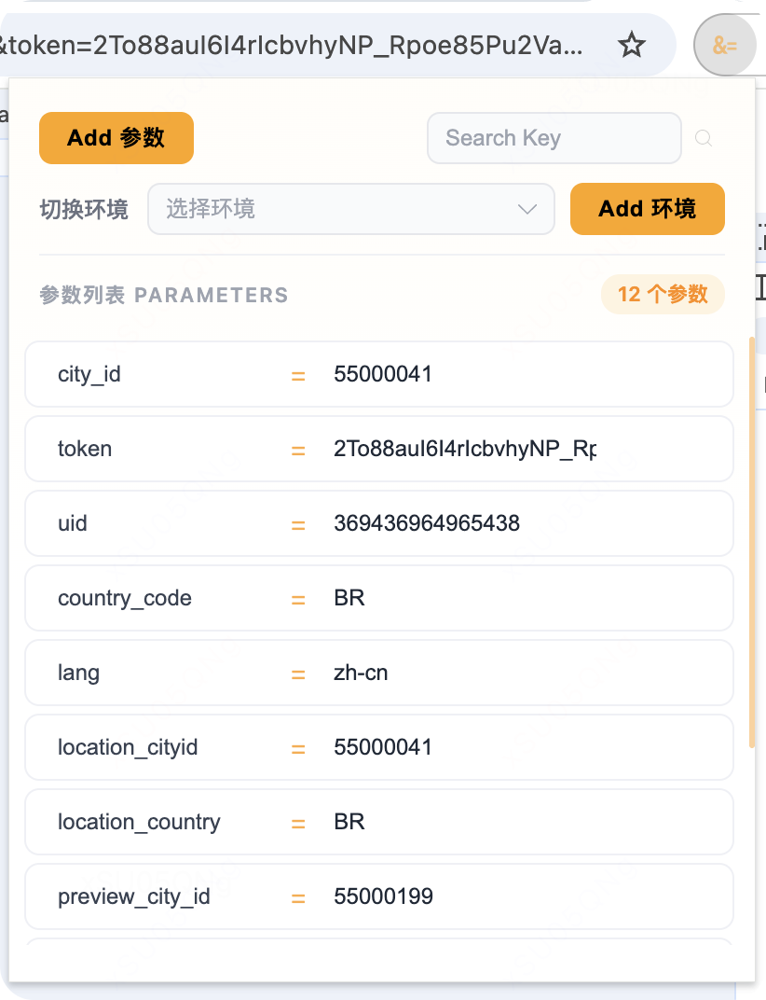

# URL Query Editor

面向 Chrome 的浏览器扩展，将 URL 查询参数以结构化的 key-value 形式呈现，支持可视化编辑、快速搜索和批量操作，旨在提升开发者的调试与测试效率。



## ✨ 功能特性
扩展启动后自动获取当前标签页的 URL，解析其中的查询字符串（Query String），并以清晰的列表形式展示。每个参数以「key = value」的形式呈现，支持参数数量统计，便于快速了解当前页面的参数结构。

- 📋 **自动解析 URL 参数**：打开扩展后自动获取当前页面的所有查询参数
- ✏️ **修改参数值**：直接在输入框中修改参数值并立即刷新页面导航
- ✏️ **新增参数值**：通过 Add 按钮打开弹窗，输入 key 和 value 即可添加新参数
- ✏️ **删除参数值**：提供删除按钮，点击后移除该参数并立即刷新页面导航
- ⚡ **参数搜索**：包含大量参数时，可通过顶部搜索框按 key 进行检索
- ⚡ **一键复制**：可将参数值快速复制到剪贴板

## 🔐 安全与兼容

扩展仅对普通网页生效，不会尝试编辑 `chrome://`、`edge://`、`about:` 等浏览器内部页面，避免权限与安全风险。

## 🚀 安装到 Chrome 浏览器

### 方法一：开发者模式加载（推荐）

1. **打包项目**
   ```bash
   pnpm install
   pnpm run build
   ```
   打包后的文件会在 `dist` 目录中。

2. **打开 Chrome 扩展管理页面**
   - 在地址栏输入 `chrome://extensions/` 并回车
   - 或者点击浏览器右上角三点菜单 → 更多工具 → 扩展程序

3. **启用开发者模式**
   - 在页面右上角打开 **"开发者模式"** 开关

4. **加载扩展**
   - 点击 **"加载已解压的扩展程序"** 按钮
   - 选择项目的 `dist` 文件夹
   - 扩展安装完成！

## 🛠️ 技术栈

- **Vue 3**
- **TypeScript**
- **Vite**
- **Chrome Extension API**

## 🛠️ 开发

### 环境要求

- Node.js 20.19+ 或 22.12+
- pnpm（推荐）或 npm

### 安装依赖

```bash
pnpm install
```

### 开发模式

```bash
pnpm run dev
```

### 打包

```bash
pnpm run build
```

打包后的文件在 `dist` 目录中。

### 更新扩展

如果修改了代码：

1. 重新打包：`pnpm run build`
2. 在 `chrome://extensions/` 页面找到你的扩展
3. 点击扩展卡片上的 **刷新按钮** 🔄（不需要重新加载整个扩展）

