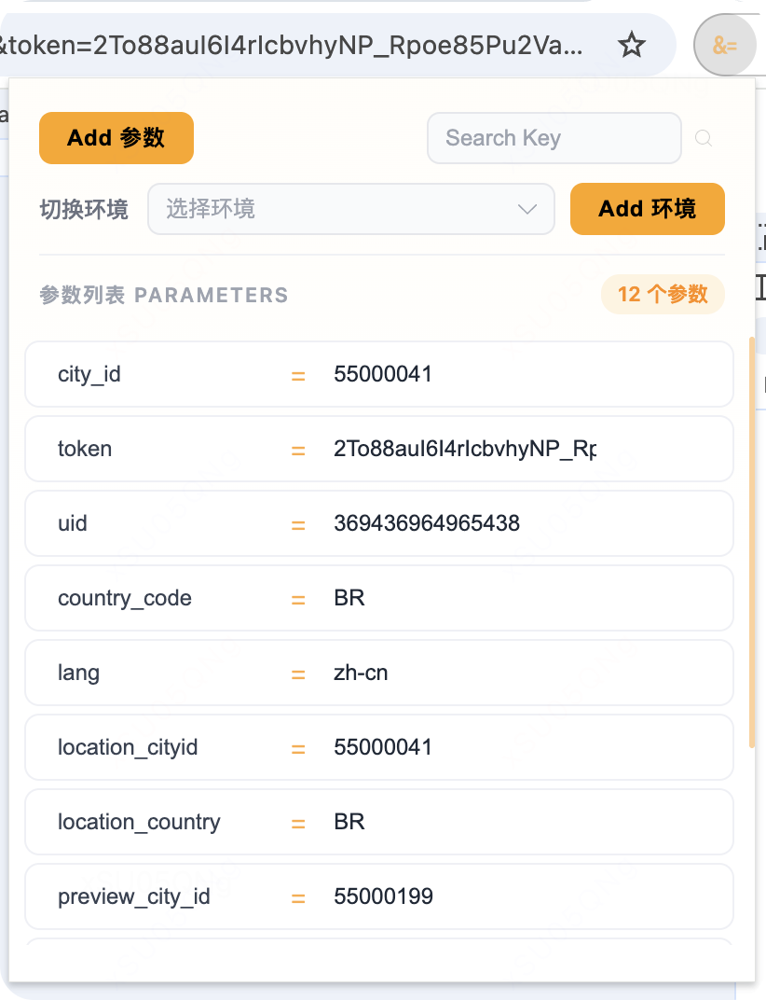

# URL Query Editor

面向 Chrome 的浏览器扩展，将 URL 查询参数以结构化的 key-value 形式呈现，支持可视化编辑、环境切换、快速搜索和批量操作，旨在提升开发者的调试与测试效率。



## ✨ 功能特性

扩展启动后自动获取当前标签页的 URL，解析其中的查询字符串（Query String），并以清晰的列表形式展示。每个参数以「key = value」的形式呈现，支持参数数量统计，便于快速了解当前页面的参数结构。

| 功能            | 说明                                                          |
| --------------- | ------------------------------------------------------------- |
| 📋 **自动解析** | 打开扩展后自动获取当前页面的所有查询参数                      |
| ✏️ **修改参数** | 直接在输入框中修改参数值，点击「应用更改」立即刷新页面        |
| ➕ **新增参数** | 通过 Add 按钮输入 key 和 value 即可添加新参数                 |
| 🗑️ **删除参数** | 点击删除按钮移除该参数并立即刷新页面                          |
| 🔄 **切换环境** | 支持配置多套环境（如 dev/test/prod），一键替换当前 URL 的域名 |
| 🔍 **参数搜索** | 大量参数时，通过搜索框按 key 快速定位                         |
| 📋 **一键复制** | 可将参数值快速复制到剪贴板                                    |

### 切换环境

在「切换环境」区域可预设多套环境（环境名 + 域名），选择后会将当前页面的 URL 域名替换为所选环境的域名，路径和查询参数保持不变。例如：`https://prod.example.com/page?id=1` 切换为 `dev` 环境后变为 `https://dev.example.com/page?id=1`。

## 🔐 安全与兼容

扩展仅对普通网页生效，不会尝试编辑 `chrome://`、`edge://`、`about:` 等浏览器内部页面，避免权限与安全风险。

## 📜 隐私政策

<a id="privacy-policy"></a>

**最后更新：** 2025 年 3 月

### 数据收集

本扩展**不收集、不上传、不分享**任何个人数据或浏览数据到外部服务器。

### 数据存储

- **本地存储**：您配置的环境列表（环境名、域名）仅保存在您设备本地的 `chrome.storage.local` 中，仅用于扩展功能，不会离开您的设备。
- **临时使用**：扩展在您打开弹窗时会读取当前标签页的 URL，用于解析和展示查询参数，该数据仅在本地处理，不会上传。

### 权限说明

| 权限 | 用途 |
|------|------|
| `storage` | 在本地保存您配置的环境列表，以便下次使用时加载 |
| `tabs` | 获取当前标签页 URL 用于解析参数，以及将修改后的 URL 应用到当前页面 |

### 第三方共享

本扩展不与任何第三方共享数据，也不使用任何分析或追踪服务。

### 联系我们

如有隐私相关疑问，请通过项目仓库提交 Issue 与我们联系。

---

## 🚀 安装到 Chrome 浏览器

### 开发者模式加载（推荐）

1. **打包项目**

   ```bash
   pnpm install
   pnpm run build
   ```

   打包后的文件会在 `dist` 目录中。

2. **打开 Chrome 扩展管理页面**
   - 在地址栏输入 `chrome://extensions/` 并回车
   - 或者点击浏览器右上角三点菜单 → 更多工具 → 扩展程序

3. **启用开发者模式**
   - 在页面右上角打开 **"开发者模式"** 开关

4. **加载扩展**
   - 点击 **"加载已解压的扩展程序"** 按钮
   - 选择项目的 `dist` 文件夹
   - 扩展安装完成！

## 🛠️ 技术栈

- **Vue 3**
- **TypeScript**
- **Vite**
- **Chrome Extension API**

## 🛠️ 开发

### 环境要求

- Node.js 20.19+ 或 22.12+
- pnpm（推荐）或 npm

### 安装依赖

```bash
pnpm install
```

### 开发模式

```bash
pnpm run dev
```

### 打包

```bash
pnpm run build
```

打包后的文件在 `dist` 目录中。

### 更新扩展

如果修改了代码：

1. 重新打包：`pnpm run build`
2. 在 `chrome://extensions/` 页面找到你的扩展
3. 点击扩展卡片上的 **刷新按钮** 🔄（不需要重新加载整个扩展）
